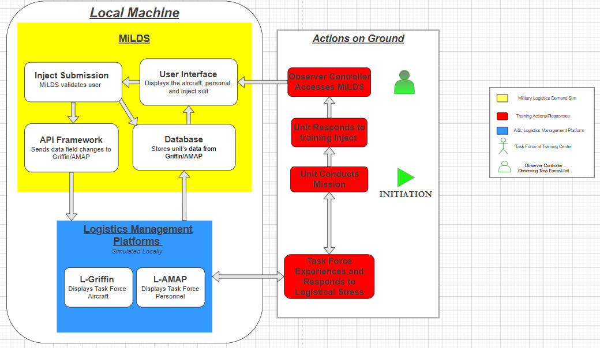
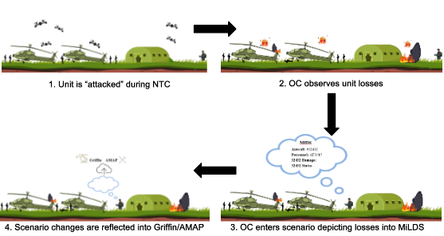

# Capstone_Base

This repository serves as the base code for the **XE401–XE402 Capstone Project**.

# Project Overview

* **Project Name:** MILDS  
* **Team Members:** CDTs Courville, Fuller, Medapati, Notaro, and Stoltzfus
* **Instructor**: COL Haynes
* **Advisor**: LTC Hutchinson
* **Project Owner**: Army Artificial Intelligence and Integration Center

The goal of this project is to develop an application that enables Observer/Controllers (OCs) at the National Training Center (NTC) to analyze and leverage information more effectively. The application will integrate data from multiple sources and tools into a single, cohesive platform to streamline workflows and test maintainers and logisticians at training centers.

## What is MiLDS?

MiLDS (Military Logistical Demand Simulator) is a web-based application that allows Observer Controllers (OCs) to simulate real-world logistical scenarios during training exercises.

MiLDS integrates with:
- **L-AMAP** (personnel system)
- **L-Griffin** (aircraft system)

The system allows users to:
- View real-time aircraft and personnel data
- Create and apply custom scenarios
- Push updates directly to AMAP and Griffin in real time
- Track system changes and revert scenarios

MiLDS acts as a bridge between training observations and logistics systems, enabling more realistic and effective training.

## System Architecture



*Figure: MiLDS system architecture and integration with AMAP and Griffin*

MiLDS consists of three main components:

1. **Frontend (React)**
   - User interface for viewing and editing data
   - Supports filtering, scenario creation, and inject actions

2. **Backend (Django + Django Ninja)**
   - Handles API requests
   - Manages database and scenario logic
   - Sends updates to external systems

3. **External Systems**
   - L-AMAP (personnel)
   - L-Griffin (aircraft)

Data Flow:
- MiLDS pulls data from AMAP and Griffin
- Users create or modify data in MiLDS
- MiLDS pushes updates back to AMAP and Griffin
- Systems remain synchronized in real time

Updates are bi-directional across all systems.

## Key Features

- **Bi-directional synchronization**
  - Changes in MiLDS update AMAP/Griffin
  - External updates sync back into MiLDS

- **Scenario creation**
  - Simulate real-world events (e.g., aircraft loss, personnel changes)

- **Scenario reversion**
  - Undo scenario effects and restore previous state

- **Logging system**
  - Tracks scenario runs and system updates

- **Interactive GUI**
  - View and edit aircraft and personnel data

- **Advanced filtering**
  - Field-based filtering (status, unit, RTL, etc.)
  - Exact matching for categorical data

## Repository Structure (view from code tab in GitHub)

```
CurrentApp/MILDS/
  app/
    back_end/
      models.py
      views.py
      urls.py
      forms.py
      migrations/
    template/
      base.html
      aircraft_*.html
      personnel_*.html
    api.py
    settings.py
    urls.py
  fixtures/
    aircraft_data.json
  manage.py
CurrentApp/React-FrontEnd
```

## Terminology

L-AMAP = Local/simulated AMAP
L-Griffin = Local/simulated Griffin

## Requirements

Python 3.11 or 3.12 (recommended 3.12). Do not use 3.14 with this Django version.

Git

PowerShell

## Environment Notes

- Developed and tested locally
- Requires Griffin and AMAP local instances for full functionality

## Quick Start

1. Navigate to backend:
   cd CurrentApp/MILDS

2. Start backend:
   python manage.py runserver

3. Start frontend:
   cd CurrentApp/React-FrontEnd/frontend
   npm start

4. Open:
   http://127.0.0.1:3000

## Getting Started

* Clone this repository:  
  ```bash
  git clone git@github.com:usma-eecs/ay26-team-repo-5-milds.git
  cd ay26-team-repo-5-milds\CurrentApp\MILDS
  ```

### Create & activate a virtual environment

py -0p                     (shows installed Pythons; look for -3.12 or -3.11)

python3.12 -m venv .venv     (or use -3.11 if 3.12 isn't installed) 

.venv\Scripts\Activate.ps1 (For Windows Terminal)
. .venv/bin/activate (For Ubuntu Container)

If activation is blocked, run once:

Set-ExecutionPolicy -Scope CurrentUser RemoteSigned

### Install dependencies

pip install -r requirements.txt

# If requirements.txt is not present:
pip install django django-ninja django-cors-headers python-dotenv httpx

### Dependencies for Container

pip install django django-ninja django-cors-headers python-dotenv httpx


### Initialize the database & load demo data

python manage.py migrate
python manage.py loaddata fixtures\aircraft_data.json
python manage.py makemigrations (only if changed models.py, run migrate again after)
python manage.py runserver

### Start frontend

cd CurrentApp/React-FrontEnd/frontend
npm install
npm start

## Running with L-AMAP and L-Griffin

MiLDS is designed to work with local versions of AMAP and Griffin.

Steps:
1. Start L-AMAP backend
2. Start L-Griffin backend
3. Load fixtures into both systems:
  ```bash
  py manage.py loaddata fixtures/Aircraft_data.json --settings=griffin_ai.settings.dev.local
  py manage.py loaddata fixtures/personnel_data.json --settings=amap.settings.dev.local
  ```
4. Start MiLDS backend
5. Start React frontend

MiLDS will now sync with both systems.

## Usage

### Aircraft Management
- View aircraft data in the GUI
- Edit fields such as status, RTL, and remarks
- Inject changes directly into Griffin

### Personnel Management
- View and edit personnel data
- Push updates to AMAP



*Figure: Observer Controller workflow using MiLDS during training exercises*

### Scenario Workflow
1. Create a scenario
2. Apply scenario → updates sent to AMAP/Griffin
3. Observe system changes
4. Revert scenario if needed

### Example Use Case

During a training exercise, an Observer Controller sees that a unit loses a helicopter and multiple personnel.

1. OC creates a scenario in MiLDS
2. MiLDS updates aircraft status to NMC in Griffin
3. MiLDS updates personnel status in AMAP
4. Logisticians react to the changes in real time

## Important Notes

- Serial is used as the primary identifier for aircraft
- Field matching differs by type:
  - Exact match: status, RTL, unit
  - Partial match: remarks, model, serial
- Scenario updates affect both local database and external systems
- Griffin and AMAP must be running for full system functionality

## Key API Endpoints

### Aircraft
- POST /api/aircraft/sync/{uic}
- POST /api/aircraft/inject/update
- POST /api/aircraft/inject/nmc

### Personnel
- POST /api/personnel/inject/update

### Scenarios
- POST /api/scenarios/
- POST /api/scenarios/revert-last/

## Known Limitations

- System currently runs on local versions of AMAP and Griffin
- Limited network testing in degraded environments
- Some features rely on external system availability

## Future Work

- Tablet/iPad optimization for field use
- Deployment outside local environment
- Improved performance under low-bandwidth conditions
- Continuous integration with updated AMAP/Griffin systems

## Common Issues

- If frontend shows old data → click “Receive Griffin”
- If updates don’t persist → ensure Griffin/AMAP are running
- If migrations fail → delete db.sqlite3 and rerun migrations
- If API fails → check backend terminal logs

## Troubleshooting

- Backend not starting:
  - Ensure virtual environment is activated
  - Check Python version (3.11 or 3.12)

- Frontend not loading:
  - Run npm install before npm start

- No data showing:
  - Ensure Griffin and AMAP are running
  - Click “Receive Griffin” in GUI

- API errors:
  - Check Django terminal logs for details

## Access Admin Page

- Add `/admin` to the end of the URL  
- Example: http://127.0.0.1:8000/admin/